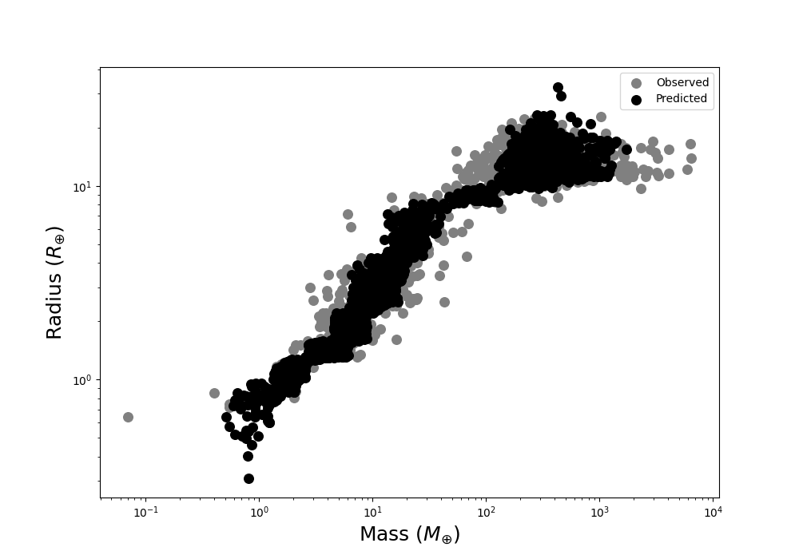
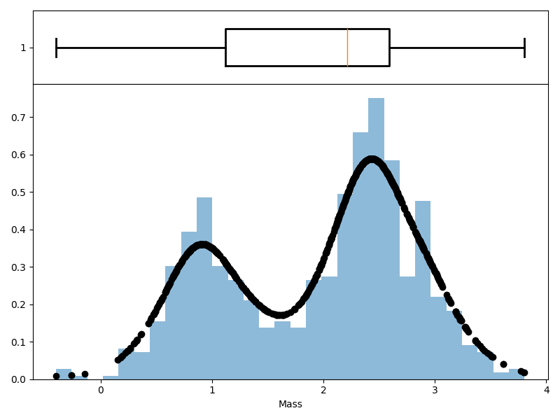

# MR_ML
Planet mass from radius with Machine Learning

# Project Overview

The work is still ongoing. The code in **`mr_ml_main.ipynb`** predicts planetary mass from the following features:
- Planetary radius
- Equilibrium temperature
- Stellar temperature
- Planetary orbital semimajor axis
- Stellar metallicity

I have explored several methods. The notebook **`mr_ml_hyperparameters_new_method.ipynb`** explores various ways of performing machine learning regression on imbalanced data.

